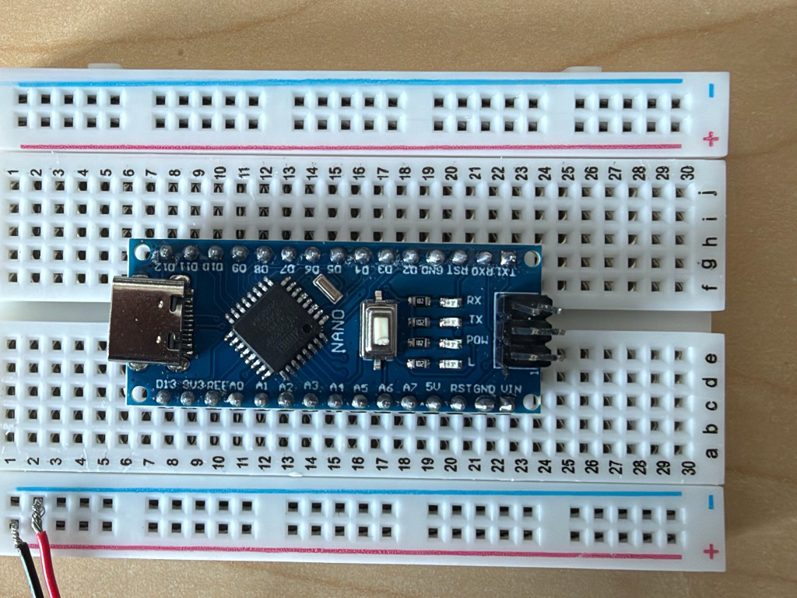

# Breadboard wiring for beginners (30-column board, rows C & G)

This guide assumes you have **never** used a breadboard before. Follow the steps **in order**.

It matches **your actual board layout** (see photo below):

- **30 columns** (numbered **1** through **30**)
- **10 rows** (**a** through **j**)
- Arduino Nano: **row c** (bottom pins) + **row g** (top pins), columns **8–22**
- **USB toward column 1** (left)

**Goal:** Connect a Raspberry Pi, Arduino Nano, buzzer, and **two** daisy-chained 8×32 LED matrices (one 8×64 display) for testing.




---

## What you need

| Item | Notes |
|------|--------|
| Small solderless breadboard | **30 columns**, rows **a–j**, **+** and **−** rails |
| Arduino Nano | USB-C clone (pin labels as on **your** board) |
| Active buzzer module | 3 pins: **VCC**, **I/O**, **GND** |
| Two 8×32 WS2812 LED matrices | Daisy-chain: panel1 **DOUT** → panel2 **DIN** |
| 5V power supply | **2–3 A** wall adapter for testing (bench only) |
| Jumper wires | Dupont wires (male–male, male–female) |
| USB cable | Pi → Nano (data USB, not charge-only) |
| Optional | 330 Ω resistor (D6 → DIN), 1000 µF capacitor (+/− rails) |

**Field / battery:** This guide uses a wall **5V** PSU. For a mobile cart ([BLUETTI AC2A](https://www.bluettipower.com/products/solar-generator-ac2a), ~3–4 h), see **[MOBILE-POWER.md](../power/MOBILE-POWER.md)**.

---

## Part 1 — Understand your breadboard

```text
        +  +  +  +  +     ← TOP POWER RAIL (+5V from PSU)
        ─────────────────
   a    o  o  o  o  o
   b    o  o  o  o  o
   c    o  o  o  o  o     ← Nano BOTTOM pins sit here (cols 8–22)
   d    o  o  o  o  o
   e    o  o  o  o  o
        ═════════════════     ← CENTER GROOVE (gap)
   f    o  o  o  o  o
   g    o  o  o  o  o     ← Nano TOP pins sit here (cols 8–22)
   h    o  o  o  o  o
   i    o  o  o  o  o
   j    o  o  o  o  o
        ─────────────────
        −  −  −  −  −     ← BOTTOM POWER RAIL (GND)
              ↑
         columns 1 … 30
```

**Rules:**

1. **Same row letter + same column number** = connected (e.g. **g14** connects to **j14**, but **not** to **c14**).
2. **Row c** and **row g** are **not** connected to each other.
3. The **+ rail** and **− rail** run the full length of the board.
4. On **your** Nano, **D6** and **D3** are on **row g** (top row of pins), not row c.

---

## Part 2 — Orient the board

1. Breadboard **long side horizontal**.
2. **Red + rail** on top, **blue − rail** on bottom.
3. Columns **1 → 30** left to right.
4. Nano **USB port on the left** (column 8 end).

---

## Part 3 — Power rails (do this first)

**Do not plug the PSU into the wall until Part 10.**

| Wire color | From | To |
|------------|------|-----|
| Red | PSU **+5V** | Any hole on the **top + rail** |
| Black | PSU **GND** | Any hole on the **bottom − rail** |

Optional **1000 µF** cap: long leg (+) → **+ rail**, short leg (−) → **− rail**.

---

## Part 4 — Install the Arduino Nano

1. **Unplug** USB.
2. Seat Nano across the groove: **row c** + **row g**, columns **8–22**.
3. **USB connector faces column 1.**

### Full pin map (from your board’s silkscreen)

Read the labels printed on **your** Nano and match this table:

| Column | **Row c** (bottom pins) | **Row g** (top pins) |
|--------|-------------------------|----------------------|
| 8 | D13 | D12 |
| 9 | 3V3 | D11 |
| 10 | REF | D10 |
| 11 | A0 | D9 |
| 12 | A1 | D8 |
| 13 | A2 | D7 |
| 14 | A3 | **D6** ← matrix data |
| 15 | A4 | D5 |
| 16 | A5 | D4 |
| 17 | A6 | **D3** ← buzzer |
| 18 | A7 | D2 |
| 19 | **5V** | GND |
| 20 | RST | RST |
| 21 | **GND** | RX0 |
| 22 | VIN | TX1 |

### Pins you will wire to

| Nano label | Breadboard hole | Use |
|------------|-----------------|-----|
| **D6** | **g14** | Matrix **DIN** |
| **D3** | **g17** | Buzzer **I/O** |
| **5V** | **c19** | Buzzer **VCC** (small load only) |
| **GND** | **c21** | Tie to **− rail** |
| **GND** | **g19** | Tie to **− rail** |

> **Important:** On your Nano, **D6** and **D3** are on **row g**, not row c. Always follow the **silkscreen labels** on the board, not a generic Nano diagram online.

---

## Part 5 — Tie Arduino ground to the GND rail

| Wire | From | To |
|------|------|-----|
| Black jumper | **c21** (Nano GND) | Bottom **− rail** |
| Black jumper | **g19** (Nano GND) | Bottom **− rail** |

---

## Part 6 — Wire the buzzer module

Place the buzzer in columns **24–26** (or any free columns).

| Buzzer pin | Wire | Breadboard hole |
|------------|------|-----------------|
| **VCC** | Red | **c19** (Nano **5V**) **or** top **+ rail** |
| **GND** | Black | Bottom **− rail** |
| **I/O** | Yellow | **h17** (same **column 17** as **g17** / D3) |

**Why h17?** Rows **f–j** share column 17, so **h17** connects to **g17** (D3) without crossing the groove.

---

## Part 7 — Wire the LED matrices (two panels)

Place panels **side by side** (left = panel 1, right = panel 2).

### 7a. Panel 1 (data from Arduino)

| Matrix wire | To |
|-------------|-----|
| **5V** (red) | Top **+ rail** |
| **GND** (white or black) | Bottom **− rail** |
| **Center RED** | Top **+ rail** |
| **Center BLACK** | Bottom **− rail** |
| **DIN** (green) | **g14** (Nano **D6**) — optional 330 Ω |

### 7b. Panel 2 (daisy-chain)

| Matrix wire | To |
|-------------|-----|
| **DIN** | Panel 1 **DOUT** (use the JST or soldered DOUT wires) |
| **5V** | Top **+ rail** (same PSU) |
| **GND** | Bottom **− rail** |
| **Center RED** | Top **+ rail** |
| **Center BLACK** | Bottom **− rail** |

```text
Nano D6 ──► panel1 DIN … panel1 DOUT ──► panel2 DIN
PSU 5V/GND ──► both panels (input + center inject)
```

---

## Part 8 — Connect Pi to Arduino

| From | To |
|------|-----|
| Raspberry Pi USB | Arduino Nano **USB** |

Pi USB = serial control only. Matrix power = **PSU** on **+ rail**.

---

## Part 9 — Final checklist (before power)

- [ ] PSU **+5V** → top **+ rail**
- [ ] PSU **GND** → bottom **− rail**
- [ ] Nano **c21** and **g19** → **− rail**
- [ ] Panel 1 **5V** + center **RED** → **+ rail**
- [ ] Panel 1 **GND** + center **BLACK** → **− rail**
- [ ] Panel 1 **DIN** → **g14** (pin labeled **D6**)
- [ ] Panel 1 **DOUT** → panel 2 **DIN**
- [ ] Panel 2 **5V** + center **RED** → **+ rail**
- [ ] Panel 2 **GND** + center **BLACK** → **− rail**
- [ ] Buzzer **VCC** → **c19** or **+ rail**
- [ ] Buzzer **GND** → **− rail**
- [ ] Buzzer **I/O** → **h17** (same column as **g17** / D3)
- [ ] **No** matrix 5V wire to Nano **5V** pin
- [ ] Nano bottom pins in **row c**, top pins in **row g**, cols **8–22**
- [ ] PSU is strong enough for **512 LEDs** (prefer 5V ≥ 5 A for testing)

---

## Part 10 — Power on and test

1. Plug **PSU** into the wall.
2. Plug **Pi USB** into the Nano.
3. On the Pi:

```bash
sudo systemctl stop raspberry-pab
export PATH="$HOME/.local/bin:$PATH"
cd ~/Raspberry-PAB
PAB_BUZZER_PORT=/dev/ttyUSB0 ./scripts/upload-matrix-test.sh
```

4. **Expected:** red → green → blue wipe, then rainbow.

5. Combined firmware:

```bash
PAB_BUZZER_PORT=/dev/ttyUSB0 ./scripts/upload-hardware.sh
sudo systemctl start raspberry-pab
```

6. Open **http://\<pi-ip\>:8080/admin** → **Test matrix** and **Test buzzer**.

---

## Breadboard map (your layout)

```text
cols:  1    8         14  17  19  21  22   24   30
       |    |          |   |   |   |   |    |    |
+ RAIL ═══════════════════════════════════════════  ← PSU, matrix 5V, center RED

row c  ···  D13…A7 5V RST GND VIN ···  [BZ] ···   ← bottom Nano pins
row g  ···  D12…D6 D3 GND ··· TX1  ···  ···  ···   ← top Nano pins (D6, D3 here)

− RAIL ═══════════════════════════════════════════  ← all GND connections

Wire to these holes:
  g14  = D6  ← matrix DIN
  g17  = D3  ← buzzer I/O (use h17 for buzzer pin)
  c19  = 5V  ← buzzer VCC
  c21, g19 = GND → − rail
```

---

## Troubleshooting

| Problem | What to check |
|---------|----------------|
| Nothing on matrix | PSU on? **+ rail** live? All GND on **− rail**? |
| Only first few LEDs | **DIN** on **g14** (label **D6**), not DOUT |
| Wrong colors / flicker | Loose wire at **g14**; add 330 Ω |
| Buzzer silent | **I/O** on column **17** (**h17**); **VCC** on **c19** |
| Wired c15/c18 by mistake | Your D6/D3 are on **row g**, not row c |
| Upload fails | `sudo systemctl stop raspberry-pab`; `ls /dev/ttyUSB*` |

---

## Safety

- Check **+** and **−** before plugging in the PSU.
- Unplug PSU while changing wires.
- Use **2–3 A** for bench testing.

---

## Next step

See [README.md](README.md) for Pi `.env` settings and firmware details.
