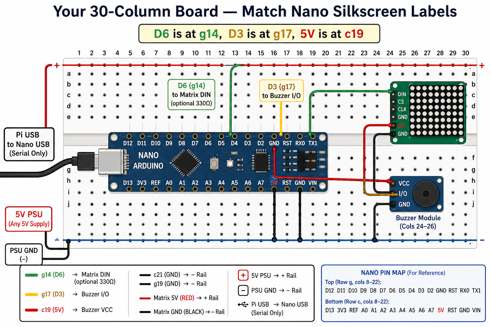

# Arduino Nano + buzzer + WS2812 matrix (legacy)

> **Production (3 panels):** use the **ESP32** combined board — see [`../esp32/WIRING.md`](../esp32/WIRING.md) and `scripts/upload-esp32-hardware.sh`.  
> This folder is the **legacy Nano** path: **two** 8×32 panels (512 LEDs), buzzer **D3**, matrix **D6**.

Hardware sketches for a **low-level-trigger** active buzzer on **D3** and **two daisy-chained 8×32 WS2812B** panels on **D6** (one **8×64** display, 512 LEDs).

## Wiring



**Photo-accurate guide (30 columns, row c / row g):** [BREADBOARD-WIRING.md](BREADBOARD-WIRING.md) — includes [your board photo](breadboard-photo-reference.png)

### Buzzer

| Buzzer | Nano |
|--------|------|
| VCC    | 5V   |
| GND    | GND  |
| I/O    | D3   |

### WS2812 matrix (two 8×32 panels → 8×64)

**Panel 1** (closest to Arduino — use its **input** / DIN side):

| Matrix pad | Connect to | Notes |
|------------|------------|-------|
| GND        | Arduino GND / PSU GND | Common ground |
| DIN        | Arduino D6  | Optional 330 Ω series resistor |
| 5V         | External 5V PSU + | Do not power LEDs from Nano 5V |
| Center RED / BLACK | Same PSU 5V / GND | Power injection |

**Panel 2** (daisy-chained):

| Matrix pad | Connect to |
|------------|------------|
| DIN        | Panel 1 **DOUT** |
| 5V         | Same PSU **+5V** (inject here too) |
| GND        | Same PSU **GND** |
| Center RED / BLACK | Same PSU 5V / GND |

**Power (bench):** Use at least a **5V 3–5 A** wall supply for testing (keep brightness low). For full brightness on 512 LEDs, plan for **5V 15–20 A**.

**Power (field / battery):** Wall PSU for bench; for cart / field (~3–4 h on AC2A), see **[MOBILE-POWER.md](../power/MOBILE-POWER.md)** (BLUETTI AC2A).

**Recommended:** 1000 µF capacitor across 5V/GND near each panel’s power inject; tie PSU GND, Arduino GND, and both matrix GNDs together.

```text
Pi USB ──► Arduino Nano
              D3 ── buzzer
              D6 ── panel1 DIN
              GND ─ common GND
PSU 5V ──────── panel1 5V + inject ──── panel2 5V + inject
panel1 DOUT ──► panel2 DIN
```

## Mac setup

```bash
brew install arduino-cli
arduino-cli core update-index
arduino-cli core install arduino:avr
arduino-cli lib install "Adafruit NeoPixel"
```

For GUI editing, install [Arduino IDE](https://www.arduino.cc/en/software) (`brew install --cask arduino-ide`).

Board settings for this USB-serial Nano clone:

- **Board:** Arduino Nano
- **Processor:** ATmega328P (Old Bootloader)
- **Port:** `/dev/cu.usbserial-110` (CH340; your port name may differ)

## Phase 1 — Matrix wiring test

Upload the standalone matrix test sketch (temporarily replaces buzzer firmware):

```bash
PAB_BUZZER_PORT=/dev/cu.usbserial-110 ./scripts/upload-matrix-test.sh
```

Expect: red → green → blue wipe on boot, then a slow rainbow. Serial monitor prints `READY` at 115200 baud.

Re-flash combined firmware when done testing.

## Phase 2 — Combined buzzer + matrix firmware

Sketch: `hardware/arduino/raspberry_pab_hardware/raspberry_pab_hardware.ino`

Upload:

```bash
PAB_BUZZER_PORT=/dev/cu.usbserial-110 ./scripts/upload-hardware.sh
```

### Serial protocol (115200 baud)

| Command | Response | Action |
|---------|----------|--------|
| *(boot)* | `READY` | Arduino ready |
| `PING` | `PONG` | Health check |
| `BEEP <freq> <vol> <count> <beepMs> <gapMs>` | `OK` | Buzzer pattern |
| `STOP` | `OK` | Silence buzzer, clear matrix |
| `BRIGHT <0-255>` | `OK` | Set matrix max brightness |
| `SCROLL <r> <g> <b> <durationMs> [mode] <text>` | `OK` | Scroll text; optional mode `0` solid, `1` rainbow, `2` pulse |
| `SOLID <r> <g> <b> <durationMs>` | `OK` | Solid color for duration (debug) |
| `FLASH <r> <g> <b> <durationMs> <intervalMs>` | `OK` | Blink solid color |
| `CHASE <r> <g> <b> <durationMs>` | `OK` | Running-dot chase |
| `CLEAR` | `OK` | All pixels off |

Test over serial monitor:

```text
PING
BRIGHT 64
SCROLL 255 200 0 10000 0 Warm Up Ada
SCROLL 0 0 0 8000 1 HELLO
SCROLL 255 255 255 8000 2 PULSE
CLEAR
```

If scrolled text looks mirrored, upside-down, or scrambled, edit the
`NEO_MATRIX_*` layout flags in `raspberry_pab_hardware.ino` (try
`NEO_MATRIX_ROWS` instead of `NEO_MATRIX_COLUMNS`, or flip `TOP`/`LEFT`/`ZIGZAG`).

## Pi configuration

Set in `.env`:

```bash
PAB_BUZZER_ENABLED=true
PAB_BUZZER_PORT=/dev/serial/by-id/usb-Serial_*-if00
PAB_BUZZER_BAUD=115200

PAB_MATRIX_ENABLED=true
PAB_MATRIX_PORT=
PAB_MATRIX_BRIGHTNESS=64
PAB_MATRIX_BAUD=115200
```

`PAB_MATRIX_PORT` can stay empty when the matrix shares the buzzer’s USB port.

Ensure the `pi` user is in the `dialout` group.

### Per-rule settings

In `/admin`, enable **Flash LED on reminder** on a rule. When `PAB_MATRIX_ENABLED=true`, the matrix uses that rule’s color, flash interval, flash duration, and chase duration.

Use **Test matrix** in the admin UI to verify without waiting for a reminder.

## Buzzer-only firmware

If you only need the buzzer (no matrix), use `hardware/arduino/raspberry_pab_buzzer/`:

```bash
PAB_BUZZER_PORT=/dev/cu.usbserial-110 ./scripts/upload-buzzer.sh
```

### Buzzer wiring notes

**Active module (low-level trigger):**

| Buzzer | Nano |
|--------|------|
| VCC | 5V |
| GND | GND |
| I/O | D3 |

**Passive piezo:** + to D3, − to GND. Set `PAB_BUZZER_MODE=passive` for pitch control.
