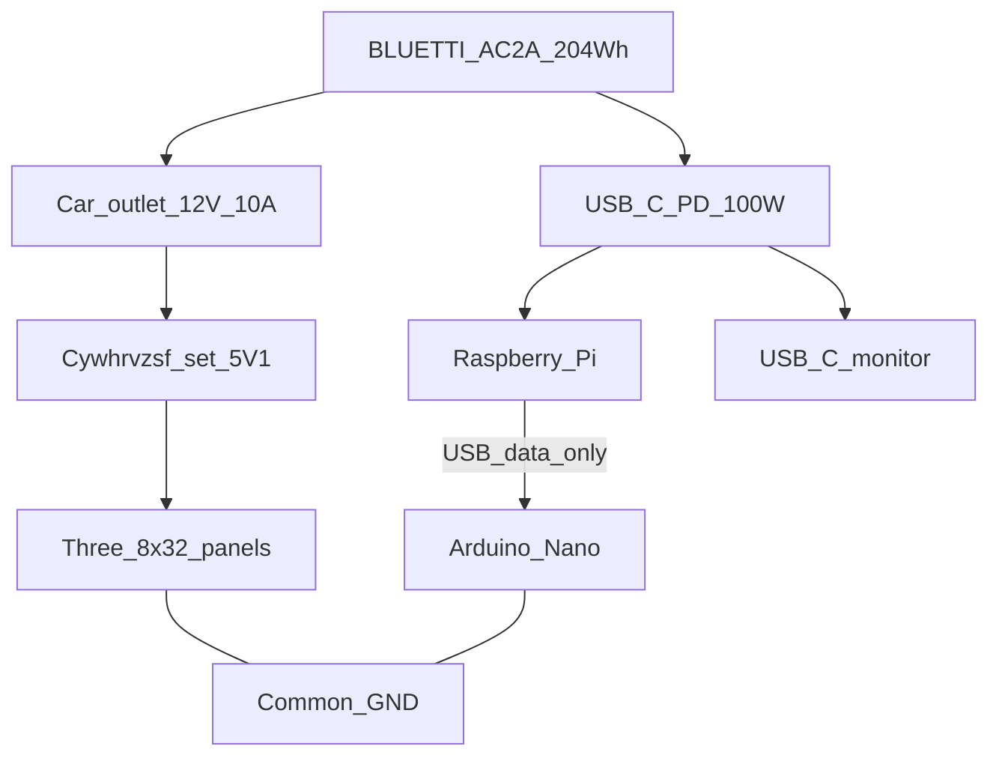

# Mobile power (3-panel field kiosk)

Field power for Raspberry-PAB with **three** 8×32 WS2812 panels (~50% brightness), a Raspberry Pi, and a USB-C portable monitor.

Bench testing still uses a wall **5V** supply — see [arduino/BREADBOARD-WIRING.md](../arduino/BREADBOARD-WIRING.md). This document is for **battery / cart** builds.

---

## Recommendation

**Primary source: [BLUETTI AC2A](https://www.bluettipower.com/products/solar-generator-ac2a)** (204.8 Wh LiFePO₄, ~300 W AC / built-in USB-C PD and 12 V car outlet).

| Source | Role |
|--------|------|
| **AC2A (chosen)** | Integrated ports replace most DIY PD/mid-buck work; ~**3–4 h** at design load |
| Larger power station | Only if you need a hard **5–6+ h** day without top-up |
| Ryobi 40V dual-rail | Legacy / spare-parts path only — see [Legacy Ryobi path](#legacy-ryobi-40v-path) |

**Design runtime on AC2A:** plan **~3–4 hours** continuous kiosk use (not 4–6 h). For longer events, use wall or solar top-up (AC2A supports up to **200 W** solar input) or a higher-Wh station.

---

## Power budget

### Loads

| Load | Design notes |
|------|----------------|
| **3× 8×32 WS2812** (768 LEDs) @ ~50% brightness (`BRIGHT` ≈ 128) | Worst case all-white ≈ 23 A @ 5 V (~115 W) — **do not** size runtime on this. Scrolling text often ~2–6 A. **Rail:** 5 V / **15–20 A**. Runtime average for LEDs: **~25–35 W**. |
| Raspberry Pi | ~8–12 W typical |
| USB-C portable monitor | ~10–20 W (use **15 W** if unknown) |

### Totals

- Average at loads: **~45–55 W**
- From AC2A (DC path + small conversion loss): plan **~50–60 W** draw
- Energy: **204.8 Wh** usable class → **~3–4 h** at ~55 W; **~2.5–3 h** if LEDs + monitor run hard

Keep software brightness capped: `PAB_MATRIX_BRIGHTNESS` ≤ **128** for “50%”.

### AC2A ports used

| AC2A port | Rating | Kiosk use |
|-----------|--------|-----------|
| **12 V / 10 A** car outlet | 120 W | Feed **one** Cywhrvzsf → **5.1 V** LED rail |
| **USB-C PD** | **100 W** max | Pi + portable monitor (hub/splitter as needed) |
| USB-A ×2 | 5 V / 2.4 A each | Optional Pi-only fallback (tight for Pi 5) |
| AC 300 W | Pure sine | Backup only (extra inversion loss) |

---

## Architecture

```text
BLUETTI AC2A (204.8 Wh)
    │
    ├─ 12 V / 10 A car outlet
    │       │
    │       ▼
    │   Cywhrvzsf buck @ 5.1 V (LED rail only)
    │       ├─► Panel 1 5V + center inject
    │       ├─► Panel 2 5V + center inject
    │       └─► Panel 3 5V + center inject
    │
    └─ USB-C PD 100 W
            ├─► Portable monitor (USB-C PD)
            └─► Raspberry Pi (same PD hub/splitter, or second cable)

Pi USB ──► Arduino Nano (serial + buzzer only — NOT matrix 5V)

Data: Nano D6 → panel1 DIN → panel1 DOUT → panel2 DIN → … → panel3
GND: Nano/Pi GND → LED rail **Vout−** (common with AC2A return)
```



### Rail A — LED matrices

**Module:** [Cywhrvzsf 600W 25A CC/CV step-down](https://a.co/d/087sPZJu) (Amazon ASIN `B0CXXDN1X9`) — **one** unit.

| Parameter | Value |
|-----------|--------|
| Input | **12–75 V** DC — AC2A **12 V** car outlet is in range |
| Output | Set to **5.0–5.2 V** (aim **~5.1 V**) |
| Current | IADJ ~**18–20 A** (CV for LEDs; fuse for faults) |
| Role | **LED 5 V rail only** — not for Pi/monitor |

**Setup (before connecting panels):**

1. Power the buck from the AC2A **12 V** outlet with **no LEDs attached**. Meter **Vout+ to Vout−**.
2. Adjust **VIADJ** to **~5.1 V**. A wrong pot setting can destroy the matrices.
3. Set **IADJ** high enough for CV under load (e.g. **~18–20 A**). Do **not** run matrices in tight CC mode.
4. Heatsink/fan as needed; fuse the **5 V LED rail** (~15–20 A).
5. At design LED average (~25–35 W) the 12 V port sees ~3–4 A. Port max is **10 A / 120 W** — enough for design peaks, **not** continuous all-white (~115 W).

**Wiring:**

- Short **12–14 AWG** to each panel’s **5V/GND** input **and** center inject pads.
- Daisy-chain **data only** (DOUT → DIN).
- **1000 µF** low-ESR cap near each panel inject; optional **330 Ω** on first DIN.
- **Never** power matrices from Pi USB or Nano **5V**.
- **Low-side current sense on the Cywhrvzsf:** do **not** jumper **Vin− to Vout−**. Tie Nano/Pi GND to **LED / Vout−** only.

### Rail B — Pi + USB-C monitor

Use the AC2A **USB-C PD (100 W)** directly — **no** mid-buck and **no** SW3516 on the default path.

- Prefer a USB-C PD hub/splitter that can feed **monitor + Pi**, **or** PD to the monitor and a second feed for the Pi if the monitor takes the full contract.
- USB-A ports on the AC2A are a weak Pi-only fallback (2.4 A); prefer USB-C PD for the Pi.
- Nano remains on **Pi USB (data)** only.

### Grounding

- Bond Nano/Pi GND to LED buck **Vout−** for WS2812 signal integrity.
- Power both rails from the **same AC2A** so negatives share the station return; do not float the LED supply relative to the Pi.

### Safety / mechanical

- Fuse on **5 V LED rail**; respect AC2A car-port current limit.
- Strain relief on the cigarette/car plug and buck wiring; vent the buck.
- AC2A BMS handles pack protection — still avoid abusing ports beyond ratings.
- Keep the station upright per BLUETTI guidance.

---

## BOM checklist

| Item | Spec / status |
|------|----------------|
| **Power station (chosen)** | [BLUETTI AC2A](https://www.bluettipower.com/products/solar-generator-ac2a) — 204.8 Wh |
| **LED buck (chosen)** | [Cywhrvzsf 600W 25A, 12–75 V](https://a.co/d/087sPZJu) ×**1** → set **5.1 V**, IADJ ~18–20 A |
| 12 V interconnect | Cigarette/car plug or pigtail from AC2A 12 V outlet to buck **Vin** (heavy enough for ~10 A) |
| USB-C PD cables / hub | C-to-C for monitor; hub or second cable for Pi |
| Wire | **12–14 AWG** silicone for panel 5 V injects |
| Fuses | **5 V LED rail** (~15–20 A); AC2A car port already protected — do not exceed 10 A continuous from 12 V |
| Caps | **Chosen:** [Upvivi electrolytic assortment](https://www.amazon.com/dp/B0D4MD8XY4) — use **3× 1000 µF ≥16 V** (one per panel inject; + to 5 V, − to GND). General-purpose is fine for NeoPixel bulk caps. |
| Resistors | **Chosen:** [BOJACK 1 Ω–1 MΩ kit](https://a.co/d/04KfHv8S) — use **one 330 Ω** (1/4 W) in series on **D6 → panel1 DIN** (optional but recommended). |
| Heatsink / fan | Cywhrvzsf includes heatsink; add fan if runs hot |
| Matrix MCU (follow-up) | ESP32 kits — for 768-LED drive later; not required for power bring-up |
| Optional solar top-up | AC2A solar input up to **200 W** (12–28 V class) for longer events |

**Not required for the AC2A default build:** Ryobi 40V pack/adapter, second Cywhrvzsf mid-buck, SW3516/SW3518 PD module.

---

## Legacy Ryobi 40V path

Earlier cart work used a Ryobi 40V adapter, **two** Cywhrvzsf bucks (5.1 V + 24 V), and an SW3516 PD source. That topology still works if you already own the parts, but it is **not** the recommended path now that AC2A provides 12 V and USB-C PD natively.

If reusing Ryobi hardware: pack → fused adapter → Cywhrvzsf @ 5.1 V (LEDs) and Cywhrvzsf @ 24 V → SW3516 (Pi/monitor). Never feed SW3516 from raw 40 V or from the LED 5 V rail. Prefer migrating field kits to AC2A when possible.

---

## Critical: three panels vs Arduino Nano RAM

The current production firmware drives **512 LEDs** (two panels) on an **ATmega328P Nano (2 KB SRAM)**.

| Panels | LEDs | Pixel buffer | Fits Nano? |
|--------|------|--------------|------------|
| 2 (today) | 512 | 1536 B | Yes, with tiny BSS (~220 B) |
| **3 (goal)** | **768** | **2304 B** | **No** — exceeds 2 KB total SRAM |

**Do not** assume bumping `LED_COUNT` to 768 on the Nano will work. For three panels you must change the matrix controller, for example:

1. Move matrix drive to an **ESP32** (or similar) with enough RAM; keep Nano for buzzer only, **or**
2. Drive the strip from the **Pi** (e.g. PIO / dedicated HAT) with enough buffer, **or**
3. Split across **two buses / two MCUs** (not one 768-LED buffer on the Nano).

### Follow-up engineering task (blocked for 3-panel field use)

- [ ] Choose matrix MCU (ESP32 recommended) or Pi-native driver
- [ ] Port scroll protocol (`SCROLL` / modes / `BRIGHT`) to that driver
- [ ] Set `LED_COUNT = 768`, logical width **96**, env `PAB_MATRIX_WIDTH=96`
- [ ] Update wiring docs for panel 3 daisy-chain + third inject
- [ ] Keep Nano sketch for buzzer-only if matrix moves off-board
- [ ] Re-verify runtime with real brightness and monitor wattage on AC2A

Until that lands, field power can still be built and tested with **two** panels on the Nano; treat the third panel as ready for power inject but not yet driven.

---

## Quick checklist before first AC2A run

- [ ] AC2A charged; 12 V car outlet and USB-C PD enabled as required by the unit
- [ ] LED buck powered from **12 V only**; set to **~5.1 V** with **no panels connected**, then IADJ ~18–20 A
- [ ] 5 V LED rail fused; all three panels have 5V/GND inject (even if only two are driven)
- [ ] Buck cool enough under load; ~5.0–5.2 V at panel
- [ ] Monitor + Pi on **AC2A USB-C PD** (hub/splitter if needed) — not on LED 5 V
- [ ] Nano USB from Pi only; matrix **not** on Nano 5 V
- [ ] Common GND at LED **Vout−** to Nano/Pi (no Vin−↔Vout− jumper on the Cywhrvzsf)
- [ ] `PAB_MATRIX_BRIGHTNESS` ≤ 128
- [ ] Expect **~3–4 h** runtime; plan top-up for longer events
- [ ] Know whether matrix firmware supports 2 or 3 panels on the current MCU
