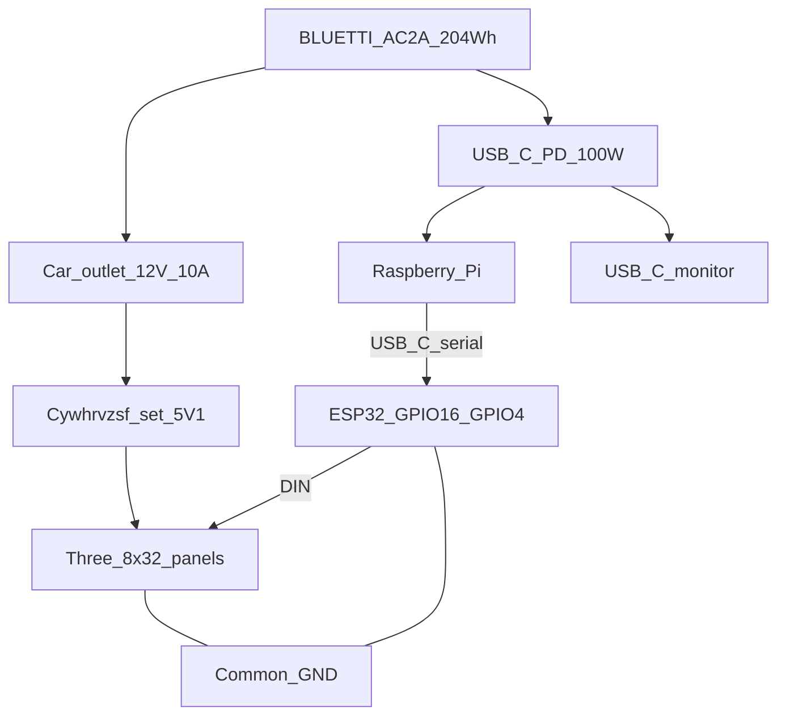

# Mobile power (3-panel field kiosk)

Field power for Raspberry-PAB with **three** 8×32 WS2812 panels (~50% brightness), a Raspberry Pi, and a USB-C portable monitor.

Bench testing still uses a wall **5V** supply — see [arduino/BREADBOARD-WIRING.md](../arduino/BREADBOARD-WIRING.md). This document is for **battery / cart** builds.

---

## Recommendation

**Primary source: [BLUETTI AC2A](https://www.bluettipower.com/products/solar-generator-ac2a)** (204.8 Wh LiFePO₄, ~300 W AC / built-in USB-C PD and 12 V car outlet).

| Source | Role |
|--------|------|
| **AC2A (chosen)** | Integrated ports replace most DIY PD/mid-buck work; ~**3–4 h** at design load |
| Larger power station | Only if you need a hard **5–6+ h** day without top-up |
| Ryobi 40V dual-rail | Legacy / spare-parts path only — see [Legacy Ryobi path](#legacy-ryobi-40v-path) |

**Design runtime on AC2A:** plan **~3–4 hours** continuous kiosk use (not 4–6 h). For longer events, use wall or solar top-up (AC2A supports up to **200 W** solar input) or a higher-Wh station.

---

## Power budget

### Loads

| Load | Design notes |
|------|----------------|
| **3× 8×32 WS2812** (768 LEDs) @ ~50% brightness (`BRIGHT` ≈ 128) | Worst case all-white ≈ 23 A @ 5 V (~115 W) — **do not** size runtime on this. Scrolling text often ~2–6 A. **Rail:** 5 V / **15–20 A**. Runtime average for LEDs: **~25–35 W**. |
| Raspberry Pi | ~8–12 W typical |
| USB-C portable monitor | ~10–20 W (use **15 W** if unknown) |

### Totals

- Average at loads: **~45–55 W**
- From AC2A (DC path + small conversion loss): plan **~50–60 W** draw
- Energy: **204.8 Wh** usable class → **~3–4 h** at ~55 W; **~2.5–3 h** if LEDs + monitor run hard

Keep software brightness capped: `PAB_MATRIX_BRIGHTNESS` ≤ **128** for “50%”.

### AC2A ports used

| AC2A port | Rating | Kiosk use |
|-----------|--------|-----------|
| **12 V / 10 A** car outlet | 120 W | Feed **one** Cywhrvzsf → **5.1 V** LED rail |
| **USB-C PD** | **100 W** max | Pi + portable monitor (hub/splitter as needed) |
| USB-A ×2 | 5 V / 2.4 A each | Optional Pi-only fallback (tight for Pi 5) |
| AC 300 W | Pure sine | Backup only (extra inversion loss) |

---

## Architecture

```text
BLUETTI AC2A (204.8 Wh)
    │
    ├─ 12 V / 10 A car outlet
    │       │
    │       ▼
    │   Cywhrvzsf buck @ 5.1 V (LED rail only)
    │       ├─► Panel 1 5V + center inject
    │       ├─► Panel 2 5V + center inject
    │       └─► Panel 3 5V + center inject
    │
    └─ USB-C PD 100 W
            ├─► Portable monitor (USB-C PD)
            └─► Raspberry Pi (same PD hub/splitter, or second cable)

Pi USB-C ──► ESP32 (serial + buzzer GPIO4 — NOT matrix 5V)

Data: ESP32 GPIO16 → panel1 DIN → panel1 DOUT → panel2 DIN → … → panel3
GND: ESP32 GND → LED rail **Vout−** (common with AC2A return)
```



### Rail A — LED matrices

**Module:** [Cywhrvzsf 600W 25A CC/CV step-down](https://a.co/d/087sPZJu) (Amazon ASIN `B0CXXDN1X9`) — **one** unit.

**Detailed pot setup (12 V → 5.1 V):** see **[CYWHRVZSF-BUCK-SETUP.md](CYWHRVZSF-BUCK-SETUP.md)**.

| Parameter | Value |
|-----------|--------|
| Input | **12–75 V** DC — AC2A **12 V** car outlet is in range |
| Output | Set to **5.0–5.2 V** (aim **~5.1 V**) |
| Current | IADJ ~**18–20 A** (CV for LEDs; fuse for faults) |
| Role | **LED 5 V rail only** — not for Pi/monitor |

**Setup (before connecting panels):** full steps in [CYWHRVZSF-BUCK-SETUP.md](CYWHRVZSF-BUCK-SETUP.md). Summary: power from AC2A **12 V** with no LEDs; set **VIADJ** ≈ **5.1 V**; set **IADJ** high (~18–20 A); fuse the 5 V rail; then connect panels + inject caps.

**Wiring:**

- Short **12–14 AWG** to each panel’s **5V/GND** input **and** center inject pads.
- Daisy-chain **data only** (DOUT → DIN).
- **1000 µF** near each panel inject; optional **330 Ω** on first DIN (ESP32 GPIO **16**).
- **Never** power matrices from Pi USB or ESP32 **5V**.
- **Low-side current sense:** do **not** jumper **Vin− to Vout−**. Tie ESP32 GND to **LED / Vout−** only.
- At design LED average (~25–35 W) the 12 V port sees ~3–4 A (max **10 A / 120 W** on AC2A — not for continuous all-white).

### Rail B — Pi + USB-C monitor

Use the AC2A **USB-C PD (100 W)** directly — **no** mid-buck and **no** SW3516 on the default path.

- Prefer a USB-C PD hub/splitter that can feed **monitor + Pi**, **or** PD to the monitor and a second feed for the Pi if the monitor takes the full contract.
- USB-A ports on the AC2A are a weak Pi-only fallback (2.4 A); prefer USB-C PD for the Pi.
- ESP32 remains on **Pi USB-C (data + DevKit 5 V)** only.

### Grounding

- Bond ESP32 GND to LED buck **Vout−** for WS2812 signal integrity.
- Power both rails from the **same AC2A** so negatives share the station return; do not float the LED supply relative to the Pi.

### Safety / mechanical

- Fuse on **5 V LED rail**; respect AC2A car-port current limit.
- Strain relief on the cigarette/car plug and buck wiring; vent the buck.
- AC2A BMS handles pack protection — still avoid abusing ports beyond ratings.
- Keep the station upright per BLUETTI guidance.

---

## BOM checklist

| Item | Spec / status |
|------|----------------|
| **Power station (chosen)** | [BLUETTI AC2A](https://www.bluettipower.com/products/solar-generator-ac2a) — 204.8 Wh |
| **LED buck (chosen)** | [Cywhrvzsf 600W 25A, 12–75 V](https://a.co/d/087sPZJu) ×**1** → set **5.1 V**, IADJ ~18–20 A |
| 12 V interconnect | Cigarette/car plug or pigtail from AC2A 12 V outlet to buck **Vin** (heavy enough for ~10 A) |
| USB-C PD cables / hub | C-to-C for monitor; hub or second cable for Pi |
| Wire | **12–14 AWG** silicone for panel 5 V injects |
| Fuses | **5 V LED rail** (~15–20 A); AC2A car port already protected — do not exceed 10 A continuous from 12 V |
| Caps | **Chosen:** [Upvivi electrolytic assortment](https://www.amazon.com/dp/B0D4MD8XY4) — use **3× 1000 µF ≥16 V** (one per panel inject; + to 5 V, − to GND). General-purpose is fine for NeoPixel bulk caps. |
| Resistors | **Chosen:** [BOJACK 1 Ω–1 MΩ kit](https://a.co/d/04KfHv8S) — use **one 330 Ω** (1/4 W) in series on **ESP32 GPIO 16 → panel1 DIN** (optional but recommended). |
| Heatsink / fan | Cywhrvzsf includes heatsink; add fan if runs hot |
| **Matrix MCU (chosen)** | 38-pin ESP32-WROOM DevKit — see [`../esp32/WIRING.md`](../esp32/WIRING.md); DIN **GPIO 16**, buzzer **GPIO 4**, **768** LEDs |
| Optional solar top-up | AC2A solar input up to **200 W** (12–28 V class) for longer events |

**Not required for the AC2A default build:** Ryobi 40V pack/adapter, second Cywhrvzsf mid-buck, SW3516/SW3518 PD module.

---

## Legacy Ryobi 40V path

Earlier cart work used a Ryobi 40V adapter, **two** Cywhrvzsf bucks (5.1 V + 24 V), and an SW3516 PD source. That topology still works if you already own the parts, but it is **not** the recommended path now that AC2A provides 12 V and USB-C PD natively.

If reusing Ryobi hardware: pack → fused adapter → Cywhrvzsf @ 5.1 V (LEDs) and Cywhrvzsf @ 24 V → SW3516 (Pi/monitor). Never feed SW3516 from raw 40 V or from the LED 5 V rail. Prefer migrating field kits to AC2A when possible.

---

## Matrix MCU: ESP32 (3 panels)

Production drives **768 LEDs** (three 8×32 panels, width **96**) on the **ESP32-WROOM** combined board (buzzer GPIO 4 + matrix GPIO 16). Wiring: [`../esp32/WIRING.md`](../esp32/WIRING.md).

| Panels | LEDs | Pixel buffer | MCU |
|--------|------|--------------|-----|
| 2 (legacy Nano) | 512 | 1536 B | ATmega328P (2 KB SRAM) — do **not** bump to 768 |
| **3 (production)** | **768** | **2304 B** | **ESP32** |

### Bring-up checklist

- [x] Matrix MCU: ESP32 (combined with buzzer)
- [x] Firmware `LED_COUNT = 768`, `MATRIX_W = 96`
- [x] Env `PAB_MATRIX_WIDTH=96`
- [x] Wire panel 3 daisy-chain + third inject (see ESP32 wiring)
- [x] Flash `upload-esp32-hardware.sh`; confirm `READY PIXELS 768`
- [ ] Re-verify runtime with real brightness and monitor wattage on AC2A

Nano sketches under `hardware/arduino/` remain for legacy 2-panel builds only.

---

## Quick checklist before first AC2A run

- [ ] AC2A charged; 12 V car outlet and USB-C PD enabled as required by the unit
- [ ] LED buck powered from **12 V only**; set to **~5.1 V** with **no panels connected**, then IADJ ~18–20 A
- [ ] 5 V LED rail fused; all three panels have 5V/GND inject (even if only two are driven)
- [ ] Buck cool enough under load; ~5.0–5.2 V at panel
- [ ] Monitor + Pi on **AC2A USB-C PD** (hub/splitter if needed) — not on LED 5 V
- [ ] ESP32 USB-C from Pi only; matrix **not** on ESP32 `5V`
- [ ] Common GND at LED **Vout−** to ESP32 GND (no Vin−↔Vout− jumper on the Cywhrvzsf)
- [ ] `PAB_MATRIX_BRIGHTNESS` ≤ 128; `PAB_MATRIX_WIDTH=96`
- [ ] Expect **~3–4 h** runtime; plan top-up for longer events
- [ ] Firmware reports `READY PIXELS 768` (ESP32 3-panel)
